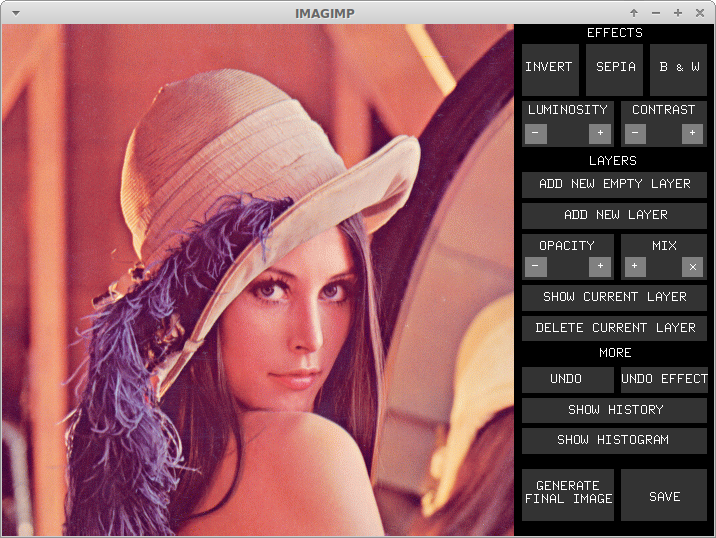
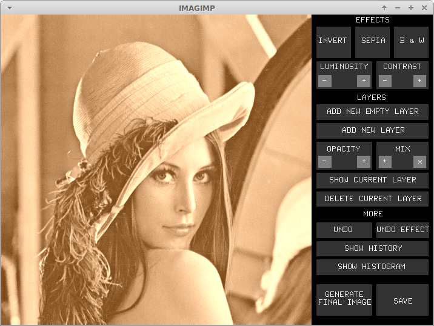
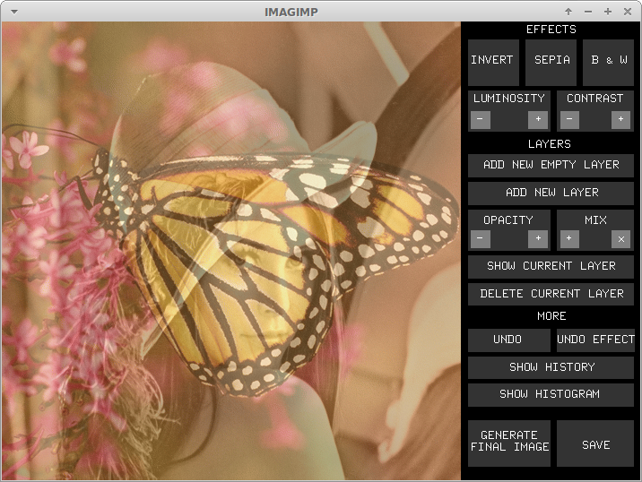
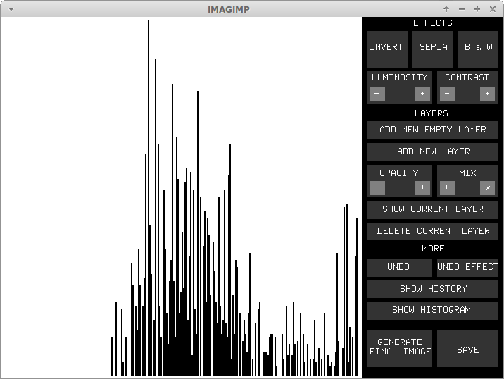

IMAGIMP
=======
Mini image processing software developped for a C course at the IMAC engineering school.  

 

 
([more screenshots](./showcase)) 

 * Layers management
 * Effect management by layer (contrast, luminosity, sepia, black and white...)
 * Save the resulting image
 * Undo stack
 * History
 * Histogramm
 * ...
 
Uses a little custom library for the GUI (developped by our teacher). Ask for input in console for some actions.
